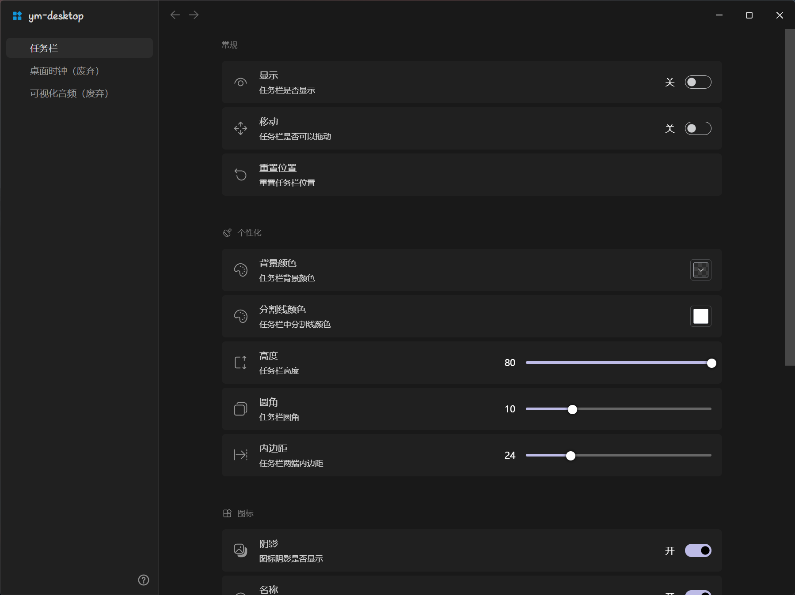
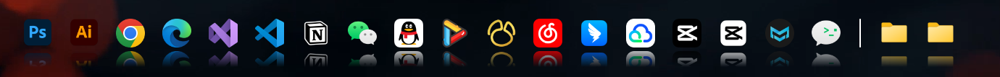

# ym-desktop 软件的说明

ym-desktop 主要功能是 dock 栏

使用 vue3+ts+electron 进行开发。

此软件为我个人学习开发，仅供学习参考，禁止商用。

# 下载安装

在发行版里面下载 ym-desktop-版本号-setup.exe 的文件后，双击安装即可使用。

## 使用软件

启动软件后桌面右下角托盘中有软件图标，单击出现配置界面，右键可以退出软件，由于配置过多不过多赘述。

# 软件界面

